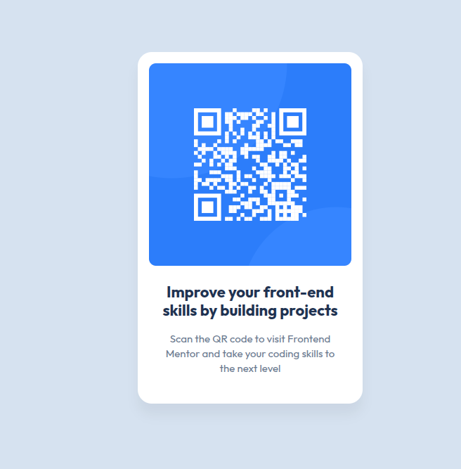

# Frontend Mentor - QR code component solution

This is my solution to the [QR code component challenge on Frontend Mentor](www.frontendmentor.io). Frontend Mentor projects will help you hone your layout skills on custom mockups.

## Overview

### Screenshot

### Links

- Solution URL: [Add solution URL here](https://your-solution-url.com)
- Live Site URL: [Add live site URL here](https://your-live-site-url.com)

## My process

### Built with

- Semantic HTML5 markup
- CSS custom properties 
- Flexbox
- Mobile-first workflow

### What I learned

This project was a great opportunity for me to get back into front-end development after a long break (around 1.5 years without practice). My main goal was to refresh my knowledge of fundamental HTML and CSS concepts.

**Key takeaways:**

*   **Skills Refresher:** I successfully recalled how to apply semantic HTML and basic CSS styles effectively.
*   **CSS Variables Practice:** I utilized CSS custom properties for managing colors based on the provided style guide.
*   **Flexbox Centering:** I practiced modern element centering using Flexbox, which made aligning the card straightforward.

I am proud that I was able to complete the challenge independently and restore my foundational skills.

## Author

- Website - [Add your name here](https://www.your-site.com)
- Frontend Mentor - [@Snezana](https://www.frontendmentor.io/profile/yourusername)
